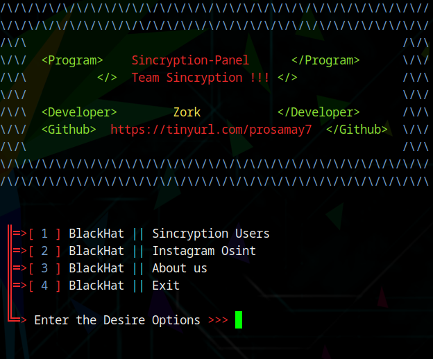

<h1 align="center">Sincryption Panel<br>
</h1>

* `📱 💀`<br />
* `A Sincryption-Panel for termux & Linux `

## Disclaimer
*This tool is for educational purposes only !*
_Don't use this to take revenge_<br />
*I will not be responsible for any misuse*

## About
* `Unlimited Instagram Osint`
* `Cross Platform`
* `Supports newest Android also`
* `No balance will be deducted`
* `Working Apis`
* `No missing Api issues,`
* `Working with all Operators/Carriers`

## Tested On :
<ul>
  <li>Termux</li>
  <li>Parrot os</li>
</ul>

## Termux Issue:
* `Termux App is no longer recieving updates on playstore`
* `due to recently introduced Google Play policy `
<br>

DON'T WORRY
* `We have a solution for that !`
<br>


You can download the latest termux app and install it

From here <a href="https://f-droid.org/repo/com.termux_118.apk">Link</a>

## Usage


#### For Termux

Update the packages
```bash
pkg up -y
```
Install some dependencies
```bash
pkg install git wget python -y
```
Clone the repository
```bash
git clone https://github.com/samay825/Sincryption-Panel
```
Go to the Sincryption-Panel directory
```bash
cd Sincryption-Panel
```
Run the script
```bash
python3 main.py
```


## Version
* `Sincryption-Panel v1.0`

## Features
* `Verify the Users of Team Sincryption`

* `Instagram Osint`

## Partners
* `Zork/kdo`

## Note
* `This Sincryption-Panel is mainly to verify team brothers`

## Licence
Apache 2.0 © Samay825


## Contact Us
* `If you have any feedback or queries`
* `Instagram: @sincryptzork`
* `Telegram: @sincryptzork`

## Telegram Channel

* `All updates of Team Sincryption will be posted here !`
* `Link : https://t.me/TeamSincryption`

